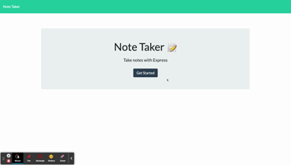

# Note Taker

## Description 
A note taking application built with Express.js

## Table of Contents

* [Installation](#installation)
* [Usage](#usage)
* [Contributing](#contributing)
* [Credits](#credits)
* [License](#license)

## Installation

Run the npm install command from the CLI, followed by npm start.

## Usage 

Either in the deployed Heroku app or by making a GET request via the browser, open up the root directory.

 
 

## Contributing
Refer to Installation

## License

This project is licensed under MIT.

## Questions

If you have any questions about this project, please contact me at burningcupidxxx@gmail.com. 
 

More projects can be viewed at https://github.com/scottybuoy